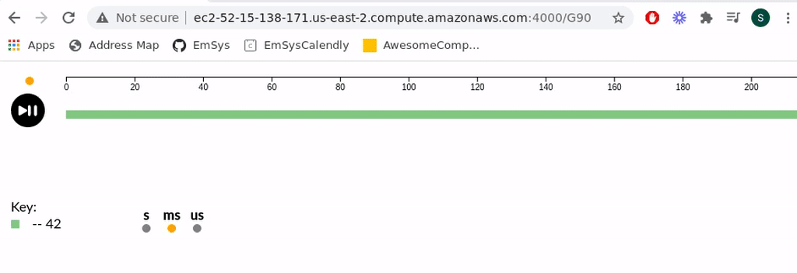
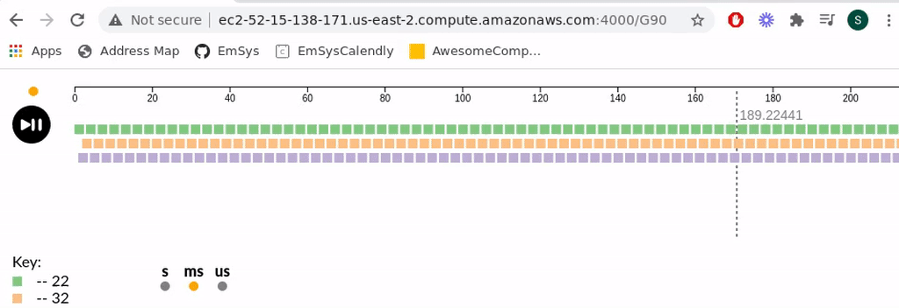
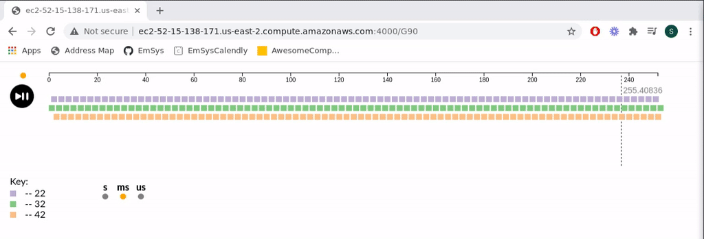

# EmSys Lab 2: Timers and Interrupts

We will be using a lightweight measurement library (let-esp32) that I have developed to instrument our TinyPico devices for this lab. In your groups, you will use the let-esp32 to perform experiments to answer questions about TinyPico; you will also learn about the following:

* Configuring hardware timers
* Interrupts

There are two videos associated with this lab:

* [[Measuring events on the TinyPico with let-esp32](https://youtu.be/UkjcmOvF6Mw)] 
* [[Configuring Hardware Timers and Interrupts](https://youtu.be/OHArGGwXDtI)] 

# Logbook structure

We will use the same git repositories setup for Lab1. It was a bit of a hassle getting these set up for the first lab, so I think it makes sense to keep the same repositories as Lab1 since everyone is all setup. 
    
Please do the following to your current git logbook repository:    
* Make a directory called `Lab2/` in the root directory of your repository    
* Make a file `Lab2/README.md`. This file is where you will write about your experiments and results.
* Make a directory `Lab2/src`. This directory is where you will contain the source code for your various experiments; it is up to you to keep this directory organised and use it to support what you write in `Lab2/README.md`


# Setting up your environment for Lab2

You should not need to do anything. Simply log into your Linux lab-machine. If your environment is configured correctly from the previous lab, it should pull in the latest version of the let-esp32 and install it on your machine.
    

## Measuring your TinyPico

To perform detailed timing measurements on the TinyPico, we will use `LetESP32.h`, a header file that will automatically be installed on your lab machine when you log in. This library implements a tracebuffer that uses one of the accurate hardware timers on the ESP32 to perform highly accurate measurements of events. The measurements are collected in a small buffer that periodically gets flushed to the web server, where they can be viewed graphically or downloaded textually (comma separated file format `.csv`).
    
Each group will have a unique page where only their device can send data to their dotDevice ID. They will configure the tracer to measure various parts of the system and view and download results just for their device.
    
To use the library, include the following at the top of your program:    

```C
#include "LetESP32.h"
```

To instantiate a trace buffer use ``LetESP32 tracer(ssid, password, ws, dd_id);``, where the arguments are: ``ssid``, the ID of the wireless network in the lab; ``password``, the password for the wireless network in the lab; ``ws``, the WebSocket address and port for the WebSocket server in the lab; and finally ``dd_id``, the dotDevice ID for your group. All of the parameters, apart from the ``dd_id`` you can leave the same.


```C
const char* ssid = "NETGEAR35";
const char* password = "magicalfinch482";
const char* ws = "ws://192.168.1.2:1234";
const char* dd_id = "wibble00";

LetESP32 tracer(ssid, password, ws, dd_id);
```

This command creates ``tracer`` our tracebuffer that we will use to measure the specific event timings in our system.

However, we are not _quite_ ready to start using it to measure our system. We need to do one last thing to connect our trace buffer to the network.

```C
void setup() {
   tracer.connect();
}
```

This command will connect our tracebuffer to the WiFi network, and WebSocket server in the lab.


Using the ``tracer`` is pretty straightforward. We pass in an event ID, which is a 16 bit ``unsigned int``, and the tracer will record the specific time when that event occurred using the built-in hardware timer.

```C
    tracer.event(42);
```


For instance, the code above will record the accurate time that the event (ID 42) occurred. Once the tracebuffer has recorded 256 events, it then flushes the events to the central webserver, where you'll be able to view and download the data.

Putting this all together, you get the following:


```C
#include "LetESP32.h"

const char* ssid = "NETGEAR35";
const char* password = "magicalfinch482";
const char* ws = "ws://192.168.1.2:1234";
const char* dd_id = "wibble00";

LetESP32 tracer(ssid, password, ws, dd_id);

void setup() {
   tracer.connect();
}

void loop() {
   delay(1);
   tracer.event(42);   
}
```

The code above will record an event with id ``42`` every 1ms. 

### Viewing and downloading the tracebuffer data

To view the trace of my device, I need to visit a particular page for my group.
My dotDevice ID is ``wibble00``. This dotDevice ID is linked to my group ID ``90``. So if I visit the page [[http://ec2-52-15-138-171.us-east-2.compute.amazonaws.com:4000/G90](http://ec2-52-15-138-171.us-east-2.compute.amazonaws.com:4000/G90)] Then I will see the tracebuffer data for my device. Notice the G90 at the end of the URL. If my group ID were 34, then it would be `/G34` at the end. **For groups 0-9 use /G00, /G01, /G02. /G03....** 

__WARNING:__ the server does occasionally go down, so please check this [[page](https://github.com/STFleming/EmSys)] to get the latest address.

Running the code above and visiting the appropriate page for our group we get the following:


We can pause the trace using the pause/play button, zoom in using the mousewheel, and see the key of events down the bottom. (__There is currently a slight bug with the X-axis at the top when the stream is paused, you should believe the numbers on the dashed marker instead__)

Let's add some more events:
```C
#include "LetESP32.h"

const char* ssid = "NETGEAR35";
const char* password = "magicalfinch482";
const char* ws = "ws://192.168.1.2:1234";
const char* dd_id = "wibble00";

LetESP32 tracer(ssid, password, ws, "wibble00");

void setup() {
   tracer.connect();
}

void loop() {
   delay(1);
   tracer.event(42);   
   delay(1);
   tracer.event(32);   
   delay(1);
   tracer.event(22);   
}
```

Visiting our groups page now we get the following trace:



We can see that the number of event types has increased as we expect. Each event gets added to it's own row, and the key tells us the mapping from colour to ID.

### Accuracy of the event tracer

As mentioned previously, the event tracer uses custom hardware timer peripherals to capture the event's precise times. This timer is a 64-bit timer that counts at 40MHz. This means that each event measurement records a 64bit integer count of the number of times the 40MHz input goes from low-to-high. This clock gives the timer an accuracy of ``1/(40*10^6)``; however, it's worth noting that there will be overheads in calling ``tracer.event()``.


### Downloading RAW data

The visual representation on the webpage is great for an overview inspection of our events and debugging; however, it probably is not very useful if we want to perform detailed measurements or processing on our data. For that reason, you can download a comma-separated variable (`.csv`) file of the data for processing in the language or spreadsheet software of your choice. _(In your logbook repo feel free to include links to shared google sheets pages where you have the raw data contained)_.
 
To download the data, append ``.csv`` to your group name at the end of the URL you visit to view the trace data. See the example in the gif below



In this CSV file each line has two variables, ``event ID``, ``64 bit timer count``. This means that to get the _real_ time you have to multiple the count by ``1/(40*10^6)``.

---------------------------------------------------------

## Question 1: what is the overhead of calling ``tracer.event()``? 

Design an experiment to measure the overhead of ``tracer.event()`` as accurately as you can. You should take multiple measurements and average them. Commit your experiment code and discuss your experiments and results in `lab2/README.md`. Comment on what you think the overheads are and how many cpu cycles the overheads are taking.

## Question 2: what is the overhead of calling ``loop()``?

Design an experiment to measure the overheads of the ``loop()`` call in the Arduino program as accurately as you can. You should take multiple measurements and average them. Commit your experiment code and discuss your experiments and results in `lab2/README.md`.

---------------------------------------------------------

# Hardware Timers and Interrupts

[[mini video lecture](https://youtu.be/OHArGGwXDtI)]

_page 123 of [[Making Embedded Systems](https://github.com/phuongtdv/PhuongTDVTesting/raw/master/Making.Embedded.Systems.pdf)] provides an excellent overview of interrupts_

In this section of the lab, you will learn about hardware timers and interrupts. Interrupts force the CPU to respond rapidly to external events, like pressing a GPIO switch or internal events, such as an exception like a divide by zero.
    
Imagine you have to boil and egg which takes 7 minutes. Which is more efficient, occasionally checking your watch to see if the time has elapsed? Or is it better to set up an alarm to alert you that your 7 minutes had passed?

The same dilemma exists for embedded systems. Say we have the following setup:    


How can we respond to the switch event as fast as possible? One possible way to detect a change on the switch is to write some code like this:

```C
void setup() {
    pinMode(5, INPUT);
}

bool pinState;
bool tmp;

void loop() {
   tmp = digitalRead(5); 
   if(tmp != pinState) {
       // the pin has changed state
       pinState = tmp; 
   }
}
```

In the above code, the microcontroller spins around the ``loop()`` body, periodically checking the state of our GPIO pin (5) to see if it has changed from the previous state. Regularly checking a pin like this is a technique called __polling__.

With the code above, we probably can pick up changes on GPIO 5 quite quickly. However, the issue comes when our Microprocessor has to do more than just spin in this loop. Consider the following:

```C
void loop() {
   tmp = digitalRead(5); 
   if(tmp != pinState) {
       // the pin has changed state
       pinState = tmp; 
       process();
   }
}
```

If our ``process()`` function call takes considerable time to compute, we might have an issue. This extra time will increase the latency that our microprocessor takes to respond to any change on GPIO 5. For some applications, this might be okay. Such as a multimedia entertainment system pause button, which can probably tolerate a few milliseconds of delay before processing. However, this can be safety-critical for other applications, for example, sensing a robotic arm's position in a factory automation setting.

Interrupts provide a hardware mechanism for responding to internal or external changes in the microcontroller.
At a high level when an interrupt occurs the following happens:

1. An interrupt request (IRQ) occurs
2. The interrupt controller pauses the execution of the CPU
3. The context of the CPU is saved
4. A small function, specific for that interrupt is looked up and loaded onto the processor
5. That small function is executed
6. The context of the CPU is restored
7. The CPU resumed from where it was interrupted

Essentially when an interrupt occurs, the control flow of the program is diverted temporarily from it's current path to execute a _small_ specific function, known as an Interrupt Service Routine (ISR).


The hardware interrupt controller will have a fixed number of interrupts. We can think of these as channels connected to various peripherals and configured to generate interrupts under different conditions. If we look in the [[ESP32 TRM](https://www.espressif.com/sites/default/files/documentation/esp32_technical_reference_manual_en.pdf)] _page 35_ we can see a few more details about the ``Interrupt Matrix`` which is the interrupt controller for the ESP32. The TRM says that each of the two cores in the system has 32 interrupt sources, and there are a few extra for various exception handling, such as low-voltage detection.

In the interrupt controller we can also specify how the interrupt should be triggered.


| Trigger | Info                                                                                    |
|---------|-----------------------------------------------------------------------------------------|
| LOW     | The interrupt is triggered while the signal is low                                      |
| HIGH    | The interrupt is trigged while the signal is high                                       |
| CHANGE  | The interrupt is triggered when the system is changing from low->high or from high->low |
| RISING  | The interrupt is triggered when the system is changing from low->high                   |
| FALLING | The interrupt is triggered when the system is changing from high->low                   |

When an interrupt is triggered, the ISR location is looked up in a hardware Interrupt Vector Table. This table contains pointers to the ISR function's location that needs to be loaded onto the CPU. For more information on function pointers, checkout [[Making Embedded Systems](https://github.com/phuongtdv/PhuongTDVTesting/raw/master/Making.Embedded.Systems.pdf)] _page 66_.

On the ESP32 an ISR is defined as follows:

```C
void IRAM_ATTR myIsr() {
    // ISR body
}
```

It is a function that returns nothing `void` return type and takes no arguments. There is also one other unusual part ``IRAM_ATTR``.
This is a compiler attribute used to signal where we want this function to be stored. On the ESP32, instructions are generally stored in the Flash memory of the ESP32 device. Flash is slow, but we have lots of it. However, in the case of interrupts, we want it to be as fast as possible. Using this attribute, we are saying that instead of the Flash memory, we want to store our ISR code in the fast internal RAM of our ESP32. Keeping our ISR here provides low latency access to the code, reducing the overall interrupt latency. However, this also raises an important consideration when designing ISRs...

__ISRs should be as short as possible__

We don't have a lot of internal RAM, and large ISRs will consume a lot of it. It's also a bad practice to have long interrupts. They hold up the processor, and when they go wrong, debugging them can be incredibly difficult. It is generally better to keep ISRs as short as you possibly can.

## Nested interrupts, disabling interrupts, and priority

Interrupts can be nested inside one another, i.e. being interrupted by another interrupt during an ISR execution. Nested interrupts can sometimes be problematic and complicated. For instance, if we need to service an interrupt request in a fixed amount of time, there is a risk that another interrupt can jump in. This can make the execution time of the interrupt non-deterministic.

Generally, it is good practice to disable other interrupts while inside an ISR. Disabling interrupts is usually a simple task. Most microcontrollers possess a single hardware register that, when written, can disable interrupts in the system. On the ESP32 in Arduino, we can use the following to temporarily disable interrupts:

```C
        noInterrupts(); // I have been having difficulty with this

        // This seems to work
        portMUX_TYPE mux = portMUX_INITIALIZER_UNLOCKED;
        portENTER_CRITICAL(&mux);
```

And to re-enable them we can use:

```C
        interrupts(); // I have been having difficulty with this

        // This seems to work to reenable interrupts
        portMUX_TYPE mux = portMUX_INITIALIZER_UNLOCKED;
        portEXIT_CRITICAL(&mux);
```

Some interrupts are marked as Non-Maskable Interrupts (NMI); these are deemed so necessary that the hardware developers decided that they cannot be disabled. One notable example of this is the processor exceptions, such as low-voltage detection.                               

Finally, interrupts can have priority over other interrupts, where a nested interruption can only occur if the interrupt is a higher priority than what is being interrupted. On some microcontrollers, this is configurable; however, on the ESP32, it is static, with different peripherals and interrupts having a fixed priority. See page 38 of the [[TRM](https://www.espressif.com/sites/default/files/documentation/esp32_technical_reference_manual_en.pdf)], where Table 10 shows the different priorities for the various interrupts.

# Hardware Timers

Unfortunately, we can't be in the lab to generate interrupts with the GPIO pins. However, we can still explore interrupts and generate them internally with the hardware timers in the ESP32.

The ESP32 has four 64-bit timers that we can use to time operations or periodically generate interrupts. **Timer0 is reserved for the Let32-ESP tracebuffer module**; however, Timers1-3 are free to use.

Each timer peripheral looks like the following:


The timer hardware is essentially composed of two components. A 16-bit prescaler divides the input clock, and a 64-bit counter counts every clock cycle of the prescaled clock. The timer also accepts an alarm input, a 64-bit value that triggers an interrupt when the counter hits the alarm value. The counter is configured to either stop after an alarm has triggered or reloaded back to zero.

Luckily for us, there are some Arduino functions that we can use to configure the timer.

First, create a pointer to the hardware timer.

```C
hw_timer_t *timer;
```

Then we can use the following function to initialise the timer and get a reference to it.

```C
timer = timerBegin(<timer number>, <timer prescale divider>, <count up or down>); 

// for example
timer = timerBegin(1, 80, true); 
```

The ``timerBegin()`` function for initialising the timer takes three arguments:

1.The number of the timer 0-3 **(Remember timer 0 is reserved as it is in use by the Let-ESP32 library)** 
2. The amount the input clock is divided by. In the above example, we have 80, which means that we are dividing the 80MHz input clock down to a 1MHz clock making our counter increment every 1us.
3. Whether the counter counts up or down. In the above example, we have set this to ``true``, meaning we count up. 

The next thing that we need to do is attach an interrupt to the timer and specify and ISR.

```C
timerAttachInterrupt(<pointer to our timer>, <pointer to our ISR> , <rising edge triggered>);

// example
void IRAM_ATTR timerISR() {
        // ISR body
}

...

timerAttachInterrupt(timer, &timerISR, true);

```

The ``timerAttachInterrupt()`` function takes three arguments:

1. the pointer to the ``hw_timer_t`` that we defined previously and initialised with ``timerBegin()``. In the example above, this is ``timer``.
2. A pointer to our ISR function. This function is executed when the timer interrupt occurs. In the example above, this is  ``timerISR``, the address of the function is passed using the ``&`` operator.
3. A ``bool`` value to state whether the interrupt is edge-triggered or not. In the example above, the interrupt will be edge-triggered.

The final two things that we need to do is tell the timer what it's alarm value is, i.e. the value that, when reached, triggers the interrupt; and enable the alarm on the timer. First, to write the alarm value into the timer, we can do:

```C
timerAlarmWrite(<pointer to our timer>, <alarm value>, <generate alarm continuously>);

// example
timerAlarmWrite(timer, 1000000, true);
```

The ``timerAlarm()`` function also takes three arguments to configure the point at which our timer module will generate an interrupt:

1. A pointer to the ``hw_timer_t`` that we defined previously and initialised with ``timerBegin()``. In the example above, this is ``timer``.
2. A 64-bit value that, when reached, will trigger the interrupt to occur. In the example, above this is `1000000`, with the prescaler value set to `80`, this will generate an interrupt every second. 
3. A boolean to say whether or not the alarm will continuously happen. In the example above, this is set to true, meaning that the interrupt will be triggered and then the counter will start all over again. Setting this to ``false`` causes the interrupt only to get triggered once.

Finally, we need to enable the timer alarm to do that we use the function:

```C
timerAlarmEnable(<pointer to our timer>);

// example
timerAlarmEnable(timer);
```

The ``timerAlarmEnable()`` just takes one argument, the pointer to the ``hw_timer_t`` that we defined previously and initialised with ``timerBegin()``. In the example above, this is ``timer``.


And that's it. If configured correctly, our ISR will now be periodically executing every second.

---------------------------------------------------------

## ~~Question 3: what is the average interrupt latency of the TinyPico?~~ 

~~Design an experiment using a hardware timer and interrupts to measure the interrupt latency of the TinyPico. You should use the let event tracer to try and calculate how long on average it takes to service and interrupt when the ISR is stored in the internal RAM of the ESP32. Commit your experiment code and discuss your experiments and results in `lab2/README.md`.~~


## Question 4: dotProduct execution time histogram

In `src/Question4/Question4.ino` you will find some code that is periodically performing a [dot product](https://en.wikipedia.org/wiki/Dot_product) computation on two randomised arrays. Use the LetESP32 to profile the execution time of the ``dotProduct()`` function. You should construct a histogram of the execution times to see the execution time of ``dotProduct()`` varies. You should just time the execution of the ``dotProduct()`` function in the ``loop()`` and not the randomise function or the ``delayMicroseconds()`` function.  

## Question 5: dotProduct exection time histogram with Timers

Use timer generated interrupts to see how much you can make the execution time of ``dotProduct()`` vary. The aim is to try and measure a __measureable variance in execution time__ (>= 1% increase in max execution time).

* I would try adding between 1 and 3 timers
* Attempt to vary the frequency at which they interrupt 
* Change the amount of work that each interrupt is doing in their ISRs
* Be careful, if you generate interrupts too frequently you can starve the processor (i.e. it always executing just ISRs) and your TinyPico can start behaving strangely, such as constantly restarting.  

## ~~Question 6: More deterministic `dotProduct()`~~ 

~~Modify the body of the ``dotProduct()`` function so that the variance in execution time is reduced in the presence of the timer interrupts you introduces in Question 5. Document and evaluate your changes.~~

~~Hints:~~
* ~~You __only__ need to add code to the body of ``dotProduct()``~~ 
* ~~The overall execution time of the ``dotProduct()`` function may increase~~
* ~~You should see a reduction in the variation of execution time, but may not be able to get it down to the same levels as Question 4~~

---------------------------------------------------------
